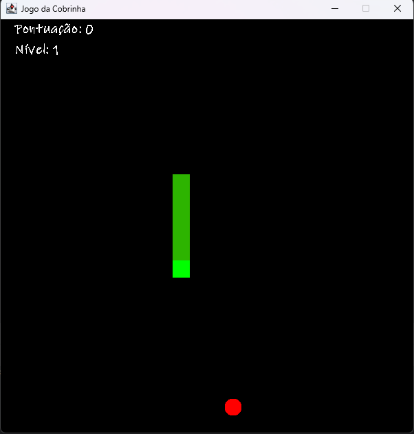

# 🐍 SnakeGame

Um clássico **Jogo da Cobrinha** desenvolvido em **Java** com interface gráfica usando **Swing**. O jogo conta com sistema de **pontuação**, níveis de **dificuldade** e uma lógica de movimentação fluida.

> 🎮 Projeto em desenvolvimento – novas funcionalidades serão adicionadas em breve!

---

## 🚀 Funcionalidades

- Movimentação da cobrinha com as teclas direcionais
- Geração de alimento aleatório
- Sistema de pontuação
- Variações de velocidade conforme a dificuldade
- Detecção de colisões (com o próprio corpo e com as bordas)

---

## 🛠️ Tecnologias utilizadas

- **Java**
- **Swing (Java GUI)**

---

## 📷 Captura de tela

> ⚠️ Substitua o caminho da imagem abaixo após adicionar o print na pasta do projeto.



---

## 🧪 Como executar

> ⚠️ É necessário ter o **Java JDK** instalado e uma **IDE** (como IntelliJ IDEA ou Eclipse).

1. Clone o repositório:
   ```bash
   git clone https://github.com/EddieNine/SnakeGame.git
   
2. Abra o projeto na sua IDE Java de preferência.

3. Compile e execute a classe principal do jogo.

📌 Status do projeto
🚧 Em desenvolvimento. Melhorias em andamento para interface, lógica de jogo e níveis.

📄 Licença
Este projeto está sob a licença MIT.

🤝 Contribuições
Sugestões, melhorias e pull requests são sempre bem-vindos!

👨‍💻 Desenvolvedor
 - Edcarlos Cruz (@EddieNine)

